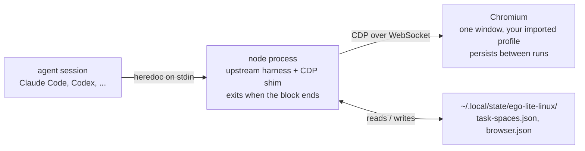

<div align="center">


**ego lite on Linux — the fastest browser for AI agents, backed by a stock Chromium**

<p>
  <a href="#install"></a>
  <a href="https://github.com/citrolabs/ego-lite"></a>
  <a href="https://nodejs.org/"></a>
  <a href="LICENSE"></a>
</p>

</div>

> ### Unofficial Linux fork
>
> This is **[`opencue/ego-lite-linux`](https://github.com/opencue/ego-lite-linux)**,
> an unofficial community fork of
> [`citrolabs/ego-lite`](https://github.com/citrolabs/ego-lite). It is **not**
> affiliated with, endorsed by, or supported by CitroLabs.
>
> **On macOS, use the official app instead** — download it from
> [lite.ego.app](https://lite.ego.app/). This port exists only because the app is
> not available for Linux.
>
> **Do not report Linux issues upstream.** Anything you can only reproduce here
> belongs in this fork's tracker; anything reproducible on the official macOS
> build belongs [upstream](https://github.com/citrolabs/ego-lite/issues).

ego lite is a browser you and your AI agents share. Your agents run browser tasks
in their own Spaces while your tabs stay yours, and tasks finish faster on fewer
tokens because the agent writes one JavaScript block instead of a long chain of
tool calls.

Upstream ships that as a macOS app: a `.dmg`, with the `ego-browser` harness
talking to it through native bindings the app injects as `globalThis.ego`.
**This fork supplies that same object on Linux**, backed by a stock Chromium over
the Chrome DevTools Protocol. The harness itself is untouched — every helper,
locator, driver and output format in `package/ego-browser/` is upstream code
running as-is. The Linux layer is `package/ego-linux/`.

---

## Requirements

| | |
|---|---|
| **OS** | Linux. The installer refuses to run anywhere else. |
| **Node** | 22 or newer. |
| **Browser** | Any of `google-chrome`, `google-chrome-stable`, `chromium`, `chromium-browser`, `brave-browser`, `microsoft-edge` on `PATH` — or set `EGO_LINUX_CHROME` to an absolute path. |

You do **not** need a special browser build. The port drives whatever Chromium
you already have.

## Install

```bash
git clone https://github.com/opencue/ego-lite-linux.git
cd ego-lite-linux
sh skills/ego-browser/scripts/install.sh
```

That checks your Node and browser, builds the unmodified upstream harness, links
the shim to `~/.local/bin/ego-browser`, and runs it once to prove it works. Set
`EGO_LINUX_BIN_DIR` to link it somewhere else.

<details>
<summary>Doing it by hand</summary>

```bash
cd package/ego-browser && CI=true npm ci && CI=true npm run build
cd ../ego-linux && npm test          # verify the port: headless, throwaway profile
ln -s "$PWD/bin/ego-browser.mjs" ~/.local/bin/ego-browser
```

`CI=true` is required, not cosmetic. The harness's `prepare` script runs
`lefthook install`, which fails on any machine with a global `core.hooksPath`
set. The script's own escape hatch is `[ "$CI" = "true" ] && exit 0`, so this is
upstream's intended path rather than a workaround.

</details>

---

## Tutorial

Five steps, in order. Each one is a single command.

### 1. Bring your logins across

```bash
ego-browser --import-chrome-profile
```

This is the Linux equivalent of ego lite's "migrate your Chrome data" onboarding
step. It copies the `Default` directory out of your real Chrome, Chromium, Edge
or Brave profile into the agent's own profile, so cookies and logins carry into
agent tasks — the agent lands on pages already signed in.

The backing browser has to be stopped for this; run `ego-browser --stop` first if
it is running.

### 2. Open the agent browser

```bash
ego-browser --open
```

A Chromium window appears. It is **not** your everyday browser: it runs from a
separate profile under `~/.local/share/ego-lite-linux/profile`, carries its own
window class, and Chrome's profile chip in the toolbar reads **`ego lite — agent`**
so you can always tell which window an agent is driving.

Run it again any time to raise that window — it usually already exists, just
behind everything else.

### 3. Run your first task

The interface is a heredoc of JavaScript on stdin, with every `ego-browser`
helper preloaded:

```bash
ego-browser <<'JS'
await page.goto('https://example.com')
console.log(await page.snapshot())
JS
```

`page.snapshot()` returns the semantic view of the page — the roles, accessible
names and `@N` refs a model reads to "see" it. From an agent CLI you normally
never type this yourself; the agent picks up the `ego-browser` skill and writes
the block for you:

```
ego-browser follow @ego_agent on x.com for me
```

The whole point is that one block does the whole task — navigate, wait, snapshot,
click, report — in a single model turn, instead of a `navigate` → look → `click` →
look round trip per step.

### 4. Work in a task space

A task space is a named set of tabs with its own cookie jar and an owner, so
parallel work does not collide and you can take a task over halfway through.
Each space is genuinely isolated from the others, and still signed in to
everything you are — see [below](#task-spaces-are-isolated-and-still-signed-in).

```bash
ego-browser <<'JS'
const task = await taskSpaces.useOrCreate('research task')
await page.goto('https://example.com')
console.log(await page.snapshot())
JS
```

A new space starts owned by `agent`. The harness selects a space with
`useTaskSpace()`, after which `handOff` / `takeOver` / `complete` act on the
selected one and take no arguments:

| Call | Owner afterwards | What it means |
|---|---|---|
| `createTaskSpace(name)` | `agent` | New space with its own tab, selected immediately. |
| `handOffTaskSpace()` | `agentDelegatedToUser` | Passed to you to finish by hand. |
| `takeOverTaskSpace()` | `agent` | The agent takes it back and returns to the space's page. |
| `claimTaskSpace(id)` | `agent` | Claim a named space. |
| `completeTaskSpace()` | `user` | Done, but the tabs stay open and become yours. |
| `closeTaskSpace()` | — | Closes the space's tabs and removes it. |

Spaces whose tabs you close by hand are reconciled away on the next call, so the
state file never accumulates ghosts.

> **Ownership is advisory here.** The native bridge enforces the user-control
> boundary inside the macOS app. Nothing on Linux can stop an agent from driving
> a window you have taken over, so `EGO_TASK_SPACE_USER_IN_CONTROL` is never
> raised.

### 5. Put it on your app launcher

```bash
ego-browser --install-desktop-entry
```

The macOS build installs as an app you click to open; this gives the Linux port
the same affordance. It writes an XDG desktop entry and a scalable icon, then
refreshes the desktop and icon caches. Clicking it runs `--open`.

The entry pins **the absolute path of the node that installed it** rather than
relying on a `#!/usr/bin/env node` shebang, because a desktop session's `PATH` is
not your shell's — a node from nvm, fnm or asdf is invisible to it, and the icon
would fail silently with no terminal to show the error. **Re-run this after
switching Node versions.**

---

## How it works

Every heredoc is its own short-lived Node process. The browser — not the process
— is what has to survive, so the state lives in files.



On the first run the shim launches Chromium with `--remote-debugging-port=0`,
reads the port Chrome negotiated out of its `DevToolsActivePort` file, and
records it. Every later run knocks on that port first and simply attaches if it
answers, so two consecutive commands see the same browser and the same tabs.

Two settings are forced on the agent profile at every launch, because inheriting
them silently breaks coordinate-based automation:

- **Page zoom is reset to 100%.** `--import-chrome-profile` copies your real
  preferences, zoom included. At 150% zoom a 1280px window lays out as 853 CSS
  px, so content the agent expects on screen falls below the fold: coordinates
  hit-test to nothing, clicks land on nothing, and `Input.dispatchMouseEvent` can
  hang outright.
- **The window is 1280×900 at device scale factor 1**, so page layout does not
  depend on your desktop's HiDPI setting.

The launcher also clears Chrome's `SingletonLock` before starting. A browser
killed without a clean shutdown leaves that lock behind, and every later launch
then aborts with "Failed to create a ProcessSingleton".

## Command reference

| Command | What it does |
|---|---|
| `ego-browser --status` | Connection state of the backing browser, as JSON. |
| `ego-browser --open` | Open or raise the shared agent browser window. |
| `ego-browser --stop` | Terminate the backing browser and clear its profile lock. |
| `ego-browser --import-chrome-profile` | Copy your real Chrome profile in, so agent tasks inherit your logins. |
| `ego-browser --install-desktop-entry` | Add it to your app launcher, with an icon. |
| `ego-browser --headless` | Run the backing browser headless. Only affects the first launch. |
| `ego-browser --help` | Usage. |

### Where things live

| Path | What |
|---|---|
| `~/.local/share/ego-lite-linux/profile` | The agent's browser profile — where the imported Chrome data goes. |
| `~/.local/state/ego-lite-linux/` | `browser.json` and `task-spaces.json`, the state shared across invocations. |
| `~/.local/share/applications/ego-lite-linux.desktop` | The app launcher entry. |
| `~/.local/share/icons/hicolor/scalable/apps/ego-lite-linux.svg` | Its icon — upstream's mark with a badge, so a Linux-port window is never mistaken for an upstream build. |

Both roots follow `XDG_DATA_HOME` / `XDG_STATE_HOME` when those are set.

### Environment overrides

| Variable | Effect |
|---|---|
| `EGO_LINUX_CHROME` | Which browser binary to launch. |
| `EGO_LINUX_PROFILE` | Which profile directory to use. |
| `EGO_LINUX_CDP_URL` | Attach to an already-running DevTools endpoint instead of launching one. |
| `EGO_LINUX_BIN_DIR` | Where `install.sh` links the CLI. Defaults to `~/.local/bin`. |

## Troubleshooting

| Symptom | Cause and fix |
|---|---|
| `Failed to create a ProcessSingleton` | A browser died without releasing `SingletonLock`. The launcher clears it automatically; if it persists, run `ego-browser --stop`. |
| Clicking the launcher icon does nothing | Usually a Node version switch — the entry pins an absolute node path. Re-run `ego-browser --install-desktop-entry`. |
| `no Chrome/Chromium binary found` | None of the candidates are on `PATH`. Set `EGO_LINUX_CHROME` to an absolute path. |
| No window appears | The backing browser is headless from an earlier `--headless` run. `ego-browser --open` swaps it for a visible one. |
| `npm ci` fails in `package/ego-browser` | A global `core.hooksPath` breaks `lefthook install`. Use `CI=true npm ci`. |

## What differs from the native app

The harness uses 15 native methods plus 2 callbacks. All are implemented. What
differs is narrow, and structural rather than unfinished:

| Native surface | Backed by | Fidelity |
|---|---|---|
| `sendCDPMessage`, `onCDPMessage`, `onSendCDPMessageError` | WebSocket to Chrome's browser endpoint | **Exact.** Chrome's flat CDP wire format is byte-identical to what the harness sends and parses — a passthrough, not a translation. |
| `listTabs`, `createTab` | `Target.getTargets` / `Target.createTarget` | **Exact**, except `active`: CDP cannot report which tab is focused, so the DevTools endpoint's most-recently-used ordering stands in. |
| `getBrowserVersion` | `Browser.getVersion` | Exact. |
| `upgradeBrowser`, `animationHighlightMouseToPosition` | no-ops | App-lifecycle and cosmetic; nothing to do on Linux. |
| `snapshot` | `DOMSnapshot.captureSnapshot` + role/name computation | **Refs exact, content rebuilt.** `@N` resolves against genuine `backendNodeId`s; roles, names and `loc=` locators are computed here and validated by upstream's own resolver. |
| the 9 task-space methods | one window, per-space browser contexts seeded from your jar | Isolation and logins both. `listTabs` stays browser-wide — see below. |

### Task spaces are isolated, and still signed in

A native Space is isolated *and* inherits your login state. On stock Chromium
those two look like they pull apart:

- `Target.createBrowserContext` → real isolation, but an empty cookie jar
- sharing the default profile → your real logins, but no isolation

The conclusion does not follow, because **the jar can be filled**. Every space
gets its own browser context, seeded from your default jar with
`Storage.getCookies` → `Storage.setCookies` at the browser level. Measured on
Chrome 148: 2,038 cookies transferred in 105 ms, a page loaded in that context
genuinely sees them, and nothing leaks back into the default jar. The
measurements and two reproducible experiments are in
[`docs/isolation-with-inherited-logins.md`](docs/isolation-with-inherited-logins.md).

If the browser refuses a context, the space degrades to plain window-only
behaviour rather than failing to open. A context is disposed once its space
loses its last tab.

What still does not match the native app:

- **A per-space `listTabs`.** The native app lists only the selected Space's
  tabs; here `listTabs` is browser-wide. `Target.createTarget` accepts no window
  id, so a tab opened for a space can land in a different window and the mapping
  drifts. Three heuristics were measured against the upstream e2e suite and each
  traded one failure for another, so reporting every page tab is what it does.
- **Spaces get no window of their own.** That was the first design and it was
  measurably worse: headless Chrome does not render tabs in background windows,
  so `document.elementFromPoint` returned null for any page in a non-foreground
  window, which broke hit-testing and tripped the harness's input fallback into
  re-synthesising drags that had already landed.

Full per-method detail lives in
[`package/ego-linux/README.md`](package/ego-linux/README.md).

## Verification

Two suites, run one at a time — both drive a browser.

```bash
cd package/ego-linux && npm test        # the port, headless, against a local fixture
cd package/ego-browser && npm run e2e   # upstream's real-browser suite, needs ego-browser on PATH
```

Upstream's suite is the real measure: 45 cases, ~520 assertions, driving this CLI
exactly as it drives the macOS app. **43 of 45 pass** on an unloaded machine. The
two failures are not port defects — one asserts `process.platform === "darwin"`,
the other asserts that `Browser.grantPermissions` with `clipboardReadWrite` is
*rejected*, which is an ego lite limitation that stock Chromium does not share.

> **Known flake: canvas drawing under load.** The three canvas cases
> intermittently count one stroke too many. This is a timing race in the
> *upstream* harness, not in the shim, and it can bite any drag-heavy work:
> `driver/pointer.ts` `finishDragProbe` waits 50 ms for a trusted `mouseup` and
> re-synthesises the whole drag in JavaScript if it has not seen one. When the
> real events land late, the page gets both.

## Design note: this port ships no MCP server

A recurring request is to wrap `ego-browser` as an MCP server. This fork
deliberately does not, and the reason is the same one that makes ego-browser
worth porting at all.

The value here is that **one heredoc replaces many tool-call round trips**. An
agent writes a single JS block that navigates, waits, snapshots, clicks, and
reports — one model turn, one process. An MCP server re-decomposes that into
`navigate` → look → `click` → look → `snapshot` → look: the exact per-call
overhead the design exists to avoid, paid on every step, in tokens and latency.
Wrapping it would make the port measurably worse at its one job.

The honest case for an MCP is an agent with no shell tool at all. If that is
your situation, the shim in `package/ego-linux/src/` is the layer to build on —
but expect to give up the token advantage, and benchmark it against the heredoc
path before committing.

---

<details>
<summary><b>About upstream ego lite</b> — the macOS app this forks</summary>

<br />

Everything in this section describes **the official macOS application**, not this
port. Some of it does not hold here: the snapshot is rebuilt from `DOMSnapshot`
rather than produced by a customised browser kernel, and `listTabs` is
browser-wide rather than per-Space. It is kept for context.

Existing tools like browser-use and agent-browser are browser automation
frameworks: they need a separate browser to drive, logins never carry cleanly,
and you and the agent end up fighting for the same tabs. ego lite is one browser
designed from the start for the two of you to share.

### Highlights of ego lite

| Feature | What it does |
|---|---|
| **Code base, not CLI base, for faster runs with fewer tokens on complex tasks** | The capabilities ego lite exposes to the agent are wrapped as JavaScript functions the agent calls directly. The agent gets to do what it does best: write code, composing a multi-step task into a single output instead of getting stuck in a "call two commands, look at the result, call two more commands" loop. Compared to the conventional CLI approach, complex workflows finish up to 2.5× faster with higher task success rates and far fewer tool calls per task. |
| **A dedicated Space for every agent** | ego lite gives each agent its own fully isolated Space. You browse up front, your agent works in the background, and they don't get in each other's way. You can see which Space has an agent running at any moment, and take it over or stop it whenever you want. |
| **Your agents multitask in Spaces, parallel workspaces inside the same browser** | Each Space gets its own AI agent or its own task, all running at the same time. Claude Code enriching 10 leads in 10 parallel Spaces. Codex scraping 5 competitor sites in 5 more. They don't collide or steal your tabs. Your mouse stays where you left it. |
| **The strongest page Snapshot on the market** | Thanks to kernel-level customization, ego lite produces the highest-quality page snapshots, the view text models rely on to "see" and act on a webpage. It reliably handles tough cases like deeply nested iframes, exactly where other approaches consistently break down. |
| **Any agent can drive it through `ego-browser`** | `ego-browser` is the connection layer between any agent CLI (Claude Code, Codex, Cursor, or a custom one) and ego lite. It exposes the browser as a set of in-page JavaScript tools: snapshot, fill, click, wait, navigate, capture. The agent writes a JavaScript snippet calling those tools, and `ego-browser` runs it on the page in one pass. |

### ego lite vs existing products

| Capability | ego lite | Browser-Use | agent-browser (Vercel) | ChatGPT Atlas | Perplexity Comet |
|---|:---:|:---:|:---:|:---:|:---:|
| Multitask in parallel | ✓ | — | — | — | — |
| Reusable skills | ✓ | — | — | — | — |
| Inherits Chrome's data | ✓ | — | — | ✓ | ✓ |
| Same browser, separate workspace | ✓ | — | — | — | — |
| Compressed semantic input | ✓ | — | ✓ | — | — |
| Controllable by external agents | ✓ | ✓ | ✓ | — | — |
| Data stored locally | ✓ | ✓ | ✓ | — | — |
| No login friction | ✓ | — | — | ✓ | ✓ |
| Daily-use browser | ✓ | — | — | ✓ | ✓ |
| Free | ✓ | ✓ | ✓ | — | — |

Upstream benchmarked ego lite against Vercel's agent-browser on four complex
browser automation tasks, finishing each up to 2.5× faster with substantially
fewer tokens. Those numbers are the macOS app's, measured by CitroLabs — this
port has not been benchmarked against them.

</details>

## Docs and community

Upstream's tutorials, tool reference and integration guides are at
[lite.ego.app/document/](https://lite.ego.app/document/) — the `ego-browser` API
they describe is the same one this port serves, since the harness is unmodified.
For upstream discussion: [Discord](https://discord.gg/5eGZVvHbTq),
[GitHub Discussions](https://github.com/citrolabs/ego-lite/discussions),
[X/Twitter](https://x.com/ego_agent). Linux-specific problems belong in
[this fork's issues](https://github.com/opencue/ego-lite-linux/issues).

## License

The contents of this repository are released under the [MIT License](LICENSE),
retaining upstream's `Copyright (c) 2026 CitroLabs` notice. The official ego lite
browser is a separate, free download for macOS; this fork drives a stock Chromium
instead and ships no browser of its own.
